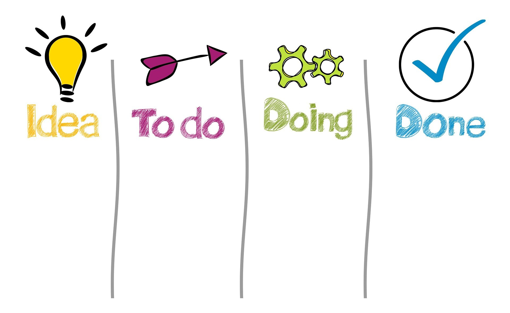
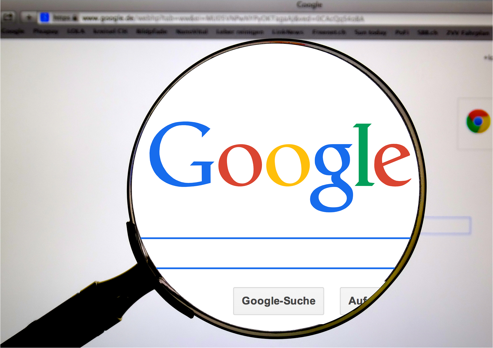

Анализа теме
============

Након што добијеш тему, потребно је да о њој **разговараш** са осталима из тима. Наставник ће свакако помоћи својим питањима и усмераваће ваш рад, али попричајте о следећем:

.. infonote::

     -	Која је прва асоцијација када прочитате назив теме? 
     -	Зашто је она важна?
     -	Шта већ знамо о овој теми? Шта смо до сада прочитали/чули о томе?
     -	Шта бисмо хтели другима да кажемо на ову тему?

Разговор о теми је веома важан, јер ћеш на тај начин да провериш шта остали о теми знају и боље ћете се сви упознати са њом.

Током разговора добро је **записивати** добре идеје, важне чињенице и питања која се јављају. У ову сврху можете користити велики бели папир, таблу или неку онлајн таблу за писање белешки ( можете покушати са https://note.ly/, https://en.linoit.com/ , https://sr.padlet.com/ или  https://miro.com/online-sticky-notes/  и сл. уколико вам наставник или родитељ помогне око креирања налога).

Планирање и реализација
-----------------------

.. infonote::

     Када се упознате са темом, неопходно је да испланирате:
     -	Шта треба да урадите?
     -	Ко треба да уради?
     -	Како треба да уради? Шта нам је потребно?
     -	Како ћете представити решење?
     -	Ко ће презентовати решење пред осталим тимовима?

Планирање је један од најважнијих корака у раду и потребно је да о томе разговарате са наставником као и да пратите његова упутства.

Ако сте изабрали тему „Занимљива историја мог града” прво попричајте шта је то занимљиво што бисте поделили са другима, да ли се може фотографисати или снимити? Са ким можете причати о историји града – наставником историје? Може ли вам он помоћи да пронађете још неког саговорника? Дакле – прво треба **ИСТРАЖИТИ** занимљивости града. Поделите посао -  неко ће причати са психологом или педагогом, неко ће претраживати интернет, неко отићи у музеј, библиотеку или туристичку организацију. 

Затим се обавезно договорите како да **ЗАБЕЛЕЖИТЕ** информације до којих сте дошли. Неко ће фотографисати или снимити знаменитост, други ће снимити разговор са стручњаком из дате области. Они који врше претрагу на интернету сакупљаће занимљиве текстове и фотографије, водећи рачуна о ауторским правима (и обавезно наводећи ко је аутор). Потребно је да установите **ГДЕ ЋЕТЕ ЧУВАТИ** материјал који пронађете.

.. suggestionnote::
     
     Када сакупите довољно материјала, заједно га анализирајте уз помоћ наставника. Одаберите само најважније и најзанимљивије податке. Разговарајте да ли вам још нешто недостаје, да ли је потребно додатно још нешто прикупити или испитати.

